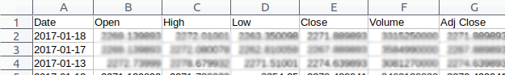

# Black-Scholes Demo

There are two ways to use the Black-Scholes formula:

1.  Having the output of the formula be option prices. This requires
    first knowing the underlying volatility.
2.  Having the output of the formula be the underlying volatility and
    the option's
    [Greeks](https://en.wikipedia.org/wiki/Greeks_(finance)) (will be
    covered later). This requires first knowing the option's
    market price.

The first of these was the initial intention of the model. Discrepancies
between the predicted and actual option prices presented opportunities
for creating low-risk profits.

The process of pricing by the Black-Scholes model involves the following
steps:

### 1. Grab historical price data

Consider an S&P 500 Index (SPX) option. Unlike stock options, index and
FX options typically have European-style exercise rights, which is an
essential assumption of the Black-Scholes pricing model.

On Unix (e.g. Ubuntu or macOS), you can grab S&P 500 time series data by
issuing the following command:

``` {.example}
wget http://ichart.finance.yahoo.com/table.csv?s=%5EGSPC
```

If you were to open this file in a spreadsheet application, you should
see something similar to the following:

 (Prices are blurred for legal reasons.)

In Python, we can load this data into a `pandas` DataFrame:

``` {.example}
from pandas import read_csv
data = read_csv('table.csv?s=%5EGSPC')
```

### 2. Determine the historical volatility

To volatility \\(\sigma\\) of a time series \\(X_{0}, \ldots, X_{N}\\) is
estimated by

\\[\hat \sigma^2 = \frac{1}{(N-1) \Delta} \sum (R_n - \bar{R})^{2},\\]

where \\(\Delta\\) is the average time series frequency,
\\(R_n = \log \frac{X_{n+1}}{X_n}\\), and \\(\bar{R}\\) is the average of the
\\(R_n\\)'s. However, in practice, we can assume that \\(\bar R = 0\\) (test
this yourself). The volatility estimator is then

\\[\hat \sigma = \sum \log^{2} \frac{X_{n+1}}{X_n}\\]

Since there are about 252 trading days in a year, practitioners often
take \\(\Delta = \frac{1}{252}\\). We can then take \\(X_{i}\\) to be the
\\(i\\)th opening or closing price.

In Python, the value of \\(\hat \sigma\\) is calculated as thus (we use
\\(N=500\\)):

``` {.example}
from math import log, sqrt
X = data['Close'][:501]
S = 0 #sum
for n in range(500):
    S = S + log(X[n+1] / X[n]) ** 2)
sigma_squared = 252 / 499 * S
sigma = sqrt(sigma_squared)
```

With this calculation, we have the volatility being about 14.2% per
year. The variance of this calculation is

\\[\begin{aligned}
\text{Var } \hat \sigma
&\approx \frac{2 \hat \sigma^{4}}{N-1} \\\\
&= 2 \times 10^{-6}.
\end{aligned}\\]

This variance estimate does not take into account the effects of
incorrect assumptions, and is therefore severely underestimated.

### 3. Determine the risk-free rate and dividend yield

For correct discounting and forward-price calculation, we need to know
the "risk free" interest rate and dividend yield of the underlying
asset. Both are easily determined by research.

The S&P 500 dividend yield is reported in most financial news papers. It
is currently at about 2%/yr.

For the risk free interest rate, we may use the 3-month T-bill yield. It
is currently at about 0.5%/yr.

### 4. Apply the Black-Scholes formula

The Black-Scholes formula, adjusted for continuous-paying dividends,
predicts the call option price \\(V\\) as:

\\[\begin{aligned}
V
&= e^{-rT} \left[ F N(d_+) - K N(d_-)\right] \\\\
d_{\pm}
&= \frac{\log \frac{F}{K} \pm \frac{1}{2} \sigma^{2} T}
{\sigma \sqrt{T}} \\\\
F &= e^{\mu T} X(0)
\end{aligned}\\]

Here, \\(r=0.005\\) is the risk-free interest short rate,
\\(\mu = r - D = -0.015\\) is the underlying drift, \\(T\\) is the time until,
\\(K\\) is the strike price, and \\(X(0)\\) is the present value of the
underlying.

We have all the information we need to calculate \\(V\\), except for the
expiration time \\(T\\) and the strike price \\(K\\). So we define the following
Python function:

``` {.example}
from math import exp, log, sqrt
import scipy.stats
r = 0.005
mu = -0.015
sigma = 0.142
X0 = 2263.69
N = scipy.stats.norm.cdf #cdf of standard normal
def blackScholes(T, K):
    F = exp(mu * T) * X0
    dplus = (log(F / K) + sigma ** 2 * T / 2) / (sigma * sqrt(T))
    dminus = dplus - sigma * sqrt(T)
    expPayoff = F * N(dplus) - K * N(dminus)
    return exp(-r * T) * expPayoff
```

For a call option expiring January 19, 2018 (\\(T=1\\) at the time of
writing) with a strike $2250, the Black Scholes equation predicts its
value to be $116.45. Its actual market value is currently $136.20
(implied volatility = 16.44%).
