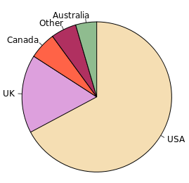
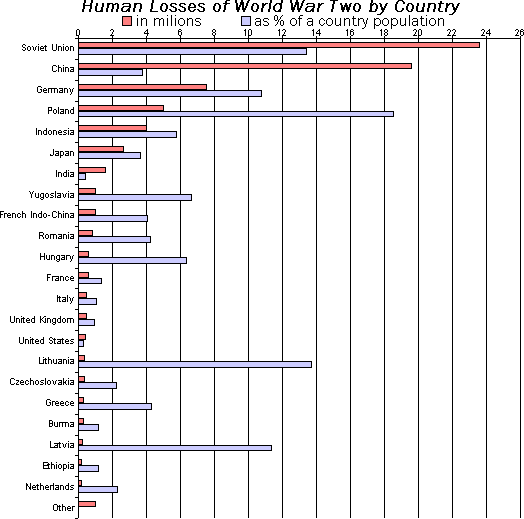
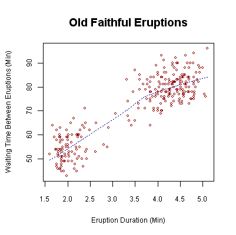
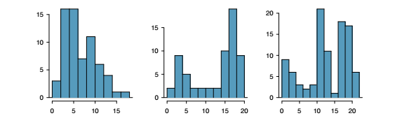
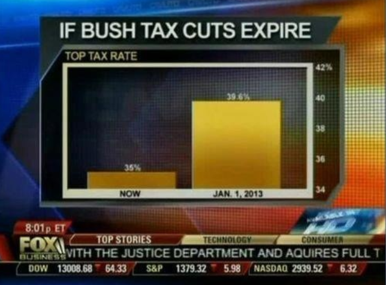
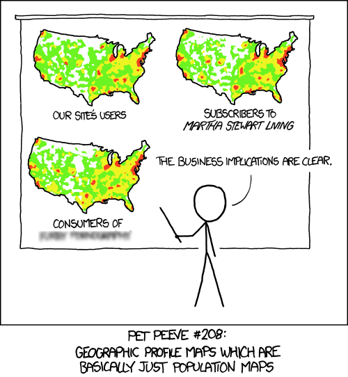

# Descriptive Statistics III

Descriptive statistics is responsible for summarizing data. So far, we have done
so using statistical measures (mean, median, IQR, etc.). However, providing some
summary statistics for a given data set may not be the best way to gain
intuition about data. Moreover, it is difficult to communicate the significance
of a given statistic to a non-technical audiance.

A better 

### Data visualization

A good data visual should be self-explanatory. Here are some types of data
visuals:

**Pie charts**: 



(Source: [Wikimedia][wik1]).

**Bar graphs**: 



(Source: [Wikimedia][wiki2]) 

**Histograms**:


(Source: [Wikimedia][wiki3])

**Scatterplots**:



(Source: [Wikimeda][wiki4])

**Stem-and-leaf plot**:


(Source: [Wikimedia][wiki5])


### The shape of data

The stem-and-leaf plot and histograms can be used to describe the shape of a
numerical "data set". A  histogram or stem-and-leaf plot can be used to
determine the modality and skewness of a data set.

The modality of a data set referrs to how many distinct "humps" it has (as
perhaps displayed by a histogram):



(Source: *OpenIntro Statistics*)

* A **unimodal** data set has one distinct hump.
* A **bimodal** data set has two distinct humps.
* A **multimodal** data set has two or more distinct humps.

The "humps" are more formally called **modes**. A data set having a
multimodal shape usually indicates that the data is generated in multiple ways.

For example, suppose that there are two types of students taking Math 110:
students that do attend class and those who don't. If attendance has a positive
impact on test scores, then one would imagine the distribution of scores to be
bimodal.

Another way to describes the shape of a data set is skewness. This refers to
the degree in which a data set in asymmetric. For a unimodal data set, one can
evaluate skewness by inspecting the "tails" of a data set. If the right tail
is longer than the left tail, then it is likely **right-skewed**. If the left
tail is longer, then it is likely **left-skewed**.

It is more likely for a data set to be right-skewed than left-skewed.


### Boxplots

Unlike other data visualizations, the **boxplot** (also called
"box-and-whisker") requires some prior explanation.


(Source: [Wikimedia][wiki6])

The above is a collection of five boxplots (boxplots are great for comparing
multiple data sets). Consider the boxplot corresponding to the first experiment.

This corresponds to the following data set:

```
650  740  760  810  850  850  880  900  930  930  950  960  960  980  980
980 1000 1000 1000 1070
```

The boxplot contains the following:

* The "box" shows the three quartiles the data set. These were calculated as
  850 (first quartile), 940 (median), and 980 (third quartile).
* The "whiskers" shows the **adjacent values**. These are the greatest and least
  values in the data set that are not potential outliers. These are computed to
  be 740 and 1070
* There may be points indicated above or below the whiskers. These show the
  potential outliers of the data set. In this case, the only potential outlier
  was 650.


The boxplot contains the following information:

### Misleading data visuals

Data visuals can be used to mislead, even if they are technically correct.

Fox News does this sort of thing all the time: 



Or, more lighthartedly, 



(Source: [XKCD](https://xkcd.com/1138/). Click link for the uncensored joke.)

[wik1]: https://en.wikipedia.org/wiki/Pie_chart#/media/File:English_dialects1997.svg
[wiki2]: https://upload.wikimedia.org/wikipedia/commons/3/35/Human_losses_of_world_war_two_by_country.png
[wiki3]: https://upload.wikimedia.org/wikipedia/commons/d/d9/Black_cherry_tree_histogram.svg
[wiki4]: https://upload.wikimedia.org/wikipedia/commons/0/0f/Oldfaithful3.png
[wiki5]: https://upload.wikimedia.org/wikipedia/commons/e/e4/Stem-and-leaf_time_tables_in_Japanese_train_stations.jpg
[wiki6]: https://en.wikipedia.org/wiki/File:Michelsonmorley-boxplot.svg
