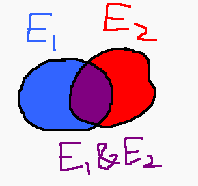

# Probability Theory III

Today, we discuss some techniques for calculating probabilities of
events.

In this course, events are typically denoted with capital letters. And
the probability of an event \\(E\\) is denoted as \\(P(E)\\).

## Probabilities of unions 

Let \\(E_1\\) and \\(E_2\\) be two events. The probability of their
union is given by the following formula:

\\[P(E_1 \text{ or } E_2) = P(E_1) + P(E_2) -
P(E_1 \text{ \\& } E_2).\\]

This formula can be justified by the following Venn diagram:



One may imagine that the probabilities of an event to correspond to
areas of the regions in the diagram. If the probabilities of each
event were added together, then their intersection (the purple region)
will be added twice. To account for this error, the probability of
the intersection must be subtracted. 

**Example.** Consider a standard, 52-card deck of playing cards.
Let \\(E_1\\) be the event of drawing a heart. And let \\(E_2\\) be the
probability of drawing a queen. The probability of drawing a heart
*or* a queen is

\\[\begin{aligned}
P(E_1 \text{ or } E_2)
&= P(E_1) + P(E_2) - P(E_1 \text{ \\& } E_2) \\\\
&= \frac{1}{4} + \frac{1}{13} - \frac{1}{52} \\\\
&= \frac{4}{13}.
\end{aligned}\\] ■ 


If two events are mutually exclusive (cannot occur simultaneously),
then \\(P(E_1 \text{ and } E_2) = 0\\) and

\\[P(E_1 + E_2) = P(E_1) + P(E_2).\\]

## Probabilities of negations

As with unions, there is a formula for calculating probabilities of
negations:

\\[ P(E) = 1 - P(\text{not }E). \\]

This formula is useful when the probability of the event
\\(\text{not }E\\) is simpler to calculate directly than \\(P(E)\\). 

## Frequency tables

Categorical data may be summarized in a **frequency table**. This table
contains the prevalance of each value in a data set.

For example, the following represents the current grade distribution
for the MyStatLab component of the homework (hypothetical, since
homework isn't actually graded):


```
Grade| freq
-----+-----
A    |   21
B    |    6
C    |    6
D    |    6
F    |   40
```

(It will be "interesting" to see how this compares to the future
grade distribution of Test I).

The right column consists of the **frequency** corresponding to each
grade. The **relative frequency** of a category in a frequency table
is the probability of obtaining that category if a single item was
randomly sampled from the data set.

The relative frequency corresponding to "F" is \frac{40}{79}. Here,
40 is the frequency of "F"s in the data set. And 79 is the number of
items in the data set (79 = 21 + 6 + 6 + 6 + 40).

In general:

\\[\text{rel freq} = \frac{\text{frequency}}
{\text{number of items in data set}}\\]

The following table shows the homework grade distribution using
relative frequencies:

```
Grade|rel. freq
-----+---------
A    |   0.2658
B    |   0.0760
C    |   0.0760
D    |   0.0760
F    |   0.5063

N = 79
```
Check that the relative frequencies sum up to 1.

For bivarate data (each item in the data set contains 2 values), a
**two-way** or **contingency** table may be employed.

For example, after I grade the first test, I might like to see the
relationship between homework completeness and test performance. I could
summarize such a relationship using a two-way table such as that shown
below:

```
      |  A  B  C  D  F| TOTAL|
------+---------------+------+
A     | 12  4  1  0  4|    21|
B     |  2  3  0  1  0|     6|
C     |  1  2  1  1  1|     6|
D     |  1  0  1  2  2|     6|
F     |  3  4  4  8 21|    40|
------+---------------+------+
TOTAL | 19 13  7 12 28|    79|

(Key: Rows = HW grade, Columns = test grade)
```

Calculating relative frequencies in two-way tables is done in a similar
manner to how they are calculated in one-way frequency tables. Simply
divide the frequency of each outcome/event by the total number of items
in the data set.

For example, suppose we pick a random student. The probability of them
getting an A on both the test *and* on the HW is 12/79. The probability of
them getting an A on the test *or* an A on the HW is

\\[\frac{21}{79} + \frac{19}{79} - \frac{12}{79} = \frac{28}{79}.\\]

