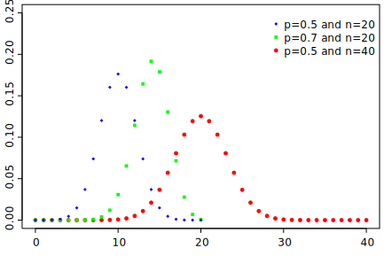

# Probability Theory VI

## Binomial coefficients

The **binomial coefficient** is an important tool in combinatorics (the
mathematics of counting). It is the number of possible ways to perform a
simple random sample (without replacement and without regards to order)
from a population.

The binomial coefficient is denoted as
\\[\left(\begin{matrix}
N \\\\ n
\end{matrix}\right).\\]
Here, \\(N\\) represents the population size and \\(n\\) is the sample size.

For example, the number of ways to sample ten items from a population of
one hundred items is
\\[\left(\begin{aligned}
100 \\\\ 10
\end{aligned}\right)
= 1.731 \times 10^{13}.
\\]
This is, of course, an absurdly large number. Calculating binomial coefficients
by hand is impractical for large values of \\(N\\).

Here are some methods of calculating binomial coefficients:

**Method 1: Use a calculator.** If you have a scientific calculator, it may have
a function to calculate binomial coefficients. In many models, this function is
represented by the symbols `nCr`. So to calculate
\\(\left(\begin{matrix} 5 \\\\ 2 \end{matrix}\right)\\), one simply enter
`5 nCr 2` on your scientific calculator.

**Method 2: Use factorials.** The **factorial** of a non-negative integer
\\(k\\) is defined as \\(k! = k \cdot (k-1) \cdot (k-2) \cdot \ldots \cdot 1\\)
with \\(0! = 1\\). The factorial of a number is the number of ways to
rearrange a sequence of items. The binomial coefficient is then defined as:
\\[\left(\begin{matrix}
N \\\\ n
\end{matrix}\right)
= \frac{N!}{n! \cdot (N-n)!}.\\]

For example,

\\[\begin{aligned}
\left(\begin{matrix}
5 \\\\ 2
\end{matrix}\right)
&= \frac{5!}{2! \cdot 3!} \\\\
&= \frac{120}{2 \cdot 6} \\\\
&= 10
\end{aligned}\\]

**Method 3: Pascal's Triangle**. The binomial coefficients can be arranged into
**Pascal's triangle**:

(Source: [Wikimedia][wik2]). When evaluated, this becomes

(Source: [Wikimedia][wik1]).  As you see, each number in the interior of
Pascal's triangle is the sum of the two numbers above it.

## Binomial distributions

A discrete random variable \\(X\\) is said to have the **Binomial distribution**
if

\\[P(X=x) = \left(\begin{matrix}n \\\\ x\end{matrix}\right) p^{x} (1-p)^{n-x}
\\]

for some \\(0 \leq p \leq 1\\). The possible values of \\(X\\) are
\\(0, 1, \ldots, n\\).

Intuitively, \\(X\\) can be interpreted as the number of successes in a
sequence of \\(n\\) independent, identical Bernoulli trials with success
probability \\(p\\). A **Bernoulli trial** is merely an experiment with
two outcomes: success or fail.

The formula defining a Binomial distribution is useful for analyzing samples
of large or infinite  populations. Suppose that certain members of a population
have some characteristic. The probability that any one member of the population
having said characteristic is known to be \\(p\\). When sampling \\(n\\) items
from this population, the number \\(X\\) of sampled items having this property
is given by a Binomial distribution.

**Theorem.** The mean and standard deviation of \\(X\\), a random variable with
the Binomial distribution, is given by

\\[\begin{aligned}
\mu    &= np \\\\
\sigma &=\sqrt{np(1-p)}
\end{aligned}\\]. ■

The following are some histograms of several Binomial distributions:

(Source: [Wikimedia][wik3]). These shapes are reminiscent of a **Bell curve**.

[wik1]: https://upload.wikimedia.org/wikipedia/commons/f/f6/Pascal%27s_triangle_5.svg
[wik2]: https://upload.wikimedia.org/wikipedia/commons/9/95/PascalsTriangleCoefficient.svg
[wik3]: https://upload.wikimedia.org/wikipedia/commons/7/75/Binomial_distribution_pmf.svg
