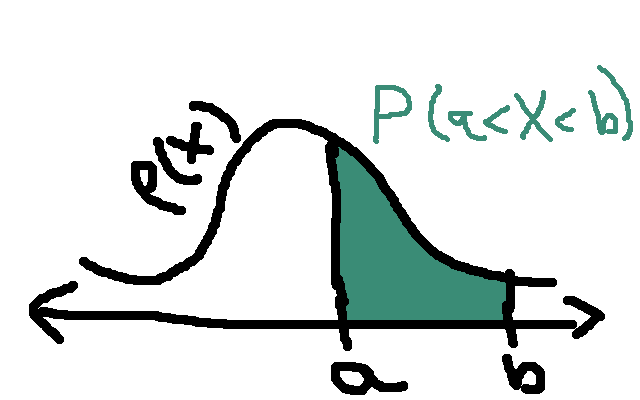

# Probability Theory VII

Below is a graph of the probability density function for
a **normally distributed random variable**.

(Source: [WikiMedia][wikidensity])

Normally-distributed variables are continuous, and may take any
value in the real number line. So its distribution is specified
by a **density function**. This is given specifically by the following
formula:

\\[p(x) = \frac{1}{\sqrt{2 \pi \sigma^2}}e^{- (x-\mu)^2/(2 \sigma)}.\\]

A normal distribution is completely specified by two parameters:
the mean \\(\mu\\) and standard deviation \\(\sigma\\). The mean
specifies the location (or at least the "x-coordinate") of the highest
value of the density function. The mean, median, and mode are all the
same for a normally distributed random variable. The standard deviation
measures roughly how spread out the distribution is. The density
function is symmetrical about the mean.

Despite being boundless, a normally-distributed variable will likely
take values close to its mean:

  - 99.7% chance of being within 3 standard deviations from the mean.
  - 95% chance of being within 2 standard deviations from the mean.
  - 68% chance of being within 1 standard deviation from the mean.

This is known as the **empirical rule**. Since the normal distribution
is so "tight", samples generated from a normal distribution are
unlikely to contain outliers.

**[[Note:** The words "normal distribution" and "Gaussian distribution"
are synonymous. ■ 

## Standard normal distribution

A **standard normal random variable** is a random variable \\(Z\\) with a
mean of 0 and a standard deviation of 1.

Let \\(X\\) be a normal random variable with a mean of \\(\mu\\) and a
standard deviation of 1. Then

\\[Z = \frac{X - \mu}{\sigma}\\]

is a standard normal random variable. For any given value of \\(X\\), the
corresponding value of \\(Z\\) is sometimes called the **z-score**.

## Probabilities = areas

Let \\(X\\) be a random variable. In statistics, it is important to be able
to calculate one of the following probabilities:

* \\(P(X < b)\\)
* \\(P(X > a)\\)
* \\(P(a < X < b)\\)

**[[Note:** If \\(X\\) is continuous, then \\(X \leq b\\) generally has the same
probability as \\(X < b\\). And \\(X \geq a\\) generally has the same
probability as \\(X > a\\). This is generally not true for discrete random
variables.  ■ 

These probabilities can be calculated by a process known as
**integration**. This is a calculus topic, but even one with only a
knowledge of algebra can grasp the basic topic.

For a positive function \\(p(x)\\), its **integral** \\(\int_a^b p(x)
dx\\) is the area of the region bounded by the curves \\(y=0\\),
\\(y=p(x)\\),\\(x=a\\), and \\(x=b\\). This area is also the the
probability of \\(X\\) being between \\(a\\) and \\(b\\):

One may think of \\(P(X < a)\\) as being the area of a region that is
unbouned (it extends infinitely to the left). Similar for regions of the
form \\(P(X > b\\). 

## Cumulative distribution functions

The **cumulative distribution function** \\(F(x)\\) of a random variable
\\(X\\) is defined as follows:

\\[F(x) = P(X \leq x).\\]

For a continuous random variable \\(X\\), this means that probabilities may
be calculated as follows:

\\[\begin{aligned}
P(X < b) &= F(b) \\\\
P(X > a) &= 1 - F(a) \\\\
P(a < X < b) &= F(b) - F(a) 
\end{aligned}\\]

For a standard normal random variable \\(Z\\), its cumulative
distribution function is given in Table II in the formula sheet.

**Problem.** IQ scores are designed to be normally distributed with a
mean of 100, and a standard deviation of 10. IQ tests, which measure IQ
scores are used to identify intellectual disabilities. Calculate the
probability that a randomly selected person's IQ score is between 70 and 85. ■ 

**Solution.** The z-score corresponding to an IQ of 70 is (70 - 100) / 10
= - 3.0. Similarly, an IQ of 85 has a z-score of -1.5. Using table II
in the formula sheet, the probability that a standard normal variable
will be between -3.0 and -1.5 is

\\[ 0.0668 - 0.0013 = 0.0655.\\]
■ 

[wikidensity]: https://upload.wikimedia.org/wikipedia/commons/a/a9/Empirical_Rule.PNG 
