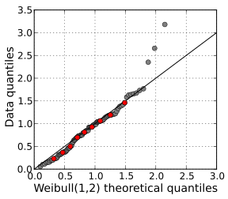

# Probability Theory VIII

## Generating normal distributions

We previously discussed about random number generators. In particular,
we talked of how such a generator can be used to generate uniformly
distributed random numbers. It can also be used to generate normally
distributed random numbers.

Let $U$ be a uniformly distributed random variable, ranging continuously
from 0 to 1. In many spreadsheet applications, such a random variable
is calculated using the `RAND` function.

If one has a random number generator for simulating $U$, then one can
build a random number generator for simulating a standard normal random
variable $Z$.

The trick is to formalize the notion of the **cumulative distribution
function** of the standard normal distribution:

\\[\Phi (z) = P(Z \leq z).\\]

This function is tabluted in Table II of the formula sheet. 
The inverse of this function \\(\Phi^{-1}\\) is called the **quantile
function**. Basically, \\(\Phi^{-1}(u)\\) is the value for which
\\(Z < \Phi^{-1}(u)\\) with probability $u$. The quantile function
generalizes the notion of quartiles and percentiles.

The quantile function for standard normal random variables exists in
many spreadsheet applications as either `NORM.INV` or `NORMINV`.

It turns out that \\(\Phi^{-1}(U)\\) is a standard normal random
variable. So in many spreadsheet applications, it is possible to
generate a standard normal random number with the following formula:

```
=NORM.INV(RAND(),0,1)
```

One can also use a table for the standard normal CDF. 

## z-scores with specified areas

The notation $z_{\alpha}$ is defined as follows:

\\[P(Z > z_{\alpha}) = z_{\alpha},\\]

where \\(Z\\) is a standard normal random variable. Alternatively,

\\[z_{\alpha} = \Phi^{-1}(1-\alpha)\\],

where \\(\Phi^{-1}\\) is the quantile function for the standard normal
random variable. This notation is useful for formalizing the important
concepts of "confidence intervals" and "critical values".

<table>
  <tr>
    <td>\(\alpha\)</td>
    <td>\(z_\alpha\)</td>
  </tr>
  <tr>
    <td>5%</td>
    <td>1.645</td>
  </tr>
  <tr>
    <td>2.5%</td>
    <td>1.960</td>
  </tr>
  <tr>
    <td>0.5%</td>
    <td>2.575</td>
  </tr>
</table>

## Testing for normality

Normality can assesed using a **quantile-quantile plot**. This is a
scatterplot comparing the quantiles (actual or observed) of two
distributions.

A **normal probability plot** is a quantile-quantile plot comparing the "actual
quantiles" (data set values or z-scores) with the corresponding "theoretical
quantiles" of the normal distribution. The calculation of quantiles is
not difficult (it unsurpsingly uses the quantile function). But it is
outside the scope of the class. Instead, a normal probability plot is
typically generated automagically using software:



(Source: [WikiMedia][wikquant])

[wikquant]: https://upload.wikimedia.org/wikipedia/commons/c/ca/Weibull_qq.svg

If the data points are sampled from a normal distribution, then the
normal probability plot should exhibit approximate linearity.
Nonlinearity may indicate the possibility that the data is non-normal.

This plot can also be used to visually identify outliers.

## Preview of p-values

Recall the previous example on coin-flipping. We flip a coin, which may
or may not be balanced. After 100 flips, we got 58 heads and 42 tails.
We wish to determine if the coin were balanced enough.

The way a (frequentist) statistican would approach this problem is as
follows:

### Step 1: Assume the null hypothesis.

This is a position of "skepticism".  We are testing to see if the coin
is unbalanced, so the null hypothesis would be that the coin is
balanced. All probabilities calculated hereafter are conditioned on the
null hypothesis.

### Step 2: Determine the theoretical distribution of the result.

Prior to flippling the coin, the number \\(H\\) of heads is Binomial with
\\(p=0.5\\) (the null hypothesis) and \\(n=100\\). Because binomial
distributions are unweidy, we instead approximate the Binomial distribution
as a normal distribution with

\\[\begin{aligned} \mu &= np \\\\ &= 50 
\\\\ \sigma &= \sqrt{n p (1-p)}
\\\\ &= 5.  \end{aligned}\\] 

### Step 3: Calculate the p-value 

The p-value is defined as the probability (conditioned on the null
hypothesis) of obtaining having obtained a result is at least as
favorable to the alternative hypotesis (the coin being unbalanced). In
this case, such a result would be either \\(H \geq 58\\) or \\(H \leq 42
\\). By symmetry, both these probabilities are the same. So the p-value
is \\(2 P(H \geq 48)\\). 

Because we are approximating $H$ with a normal distribution, we instead
use a **continuity correction**, which sets the p-value to  \\(2P(H  >
57.5)\\). Such a correction would not apply if we used the Binomial
distribution.

Let \\(Z = \frac{H - 50}{5}\\), then

\\[\begin{aligned}
\text{p-value}
&= 2 P(H > 57.5) \\\\
&= 2 P(Z > 1.5) \\\\
&\approx 0.1336
\end{aligned}\\]

### Step 4: Reject the null if p-value is small

In most sciences, a p-value of 0.05 would indicate a "statistically
significant" result and that the null hypothesis should be rejected. The
p-value in this example was much greater than that, so one would "fail
to reject" the null hypothesis.

Does this mean that the coin was balanced? Not quite. There may (and
probably is) inbalance in the coin. But such an unbalance is not
statistically detectable from the sample. Collecting a larger sample may
reveal an imbalance.


