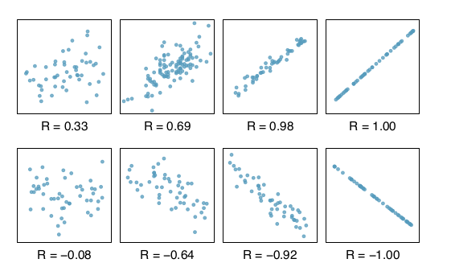

# July 31

### Correlation

In comparing random variables, we have discussed the following:

* t-tests for comparing two population means.
* z-tests for comparing two population proportions.
* F-tests for comparing multiple population means with ANOVA.
* \\(\chi^2\\) independence tests for determining if two categorical
  random variables are independent.

Today, we discuss a metric that describes the relationship between two
or more random variables, the **correlation coefficient**.

The correlation coefficient \\(r\\) between two random variables \\(x\\)
and \\(y\\) is defined as follows:

\\[r = \frac{1}{n-1} \sum \frac{x_i - \bar x}{s_x} \frac{y_i - \bar y}
{s_y}.\\]

Obviously, the sample observations \\(x_i\\) and \\(y_i\\) are paired.
\\(n\\) is the number of samples, and \\(s_x\\) and \\(s_y\\) are the
sample standard deviations. Note that the expressions
\\(\frac{x_i - \bar x}{s_x}\\) and \\(\frac{y_i - \bar y}{s_y}\\) are
the z-scores corresponding to each observation.

Here are some properties relating to correlation coefficients:

1. Correlation is bounded below by -1 and above by +1.
2. A correlation coefficent of zero means that the two random variables
   are **uncorrelated**.
3. Independent numerical random variables are uncorrelated. However, the
   reverse is not true. Uncorrelated random variables may or may not be
   independent.

### Correlations measures linear relationships

Correlations only make sense when discussing the relationship between
numerical random variables. As previously mentioned in the lecture of
paired t-tests, we can visualize each paired numerical observation as
a point on a coordinate grid. The collection of these points is called
a **scatter plot**.

The following scatter plots and corresponding correlations are taken
from *OpenIntro Statistics*:

As you see, the two scatter plots on the right fit perfect lines. And
their correlations are 1 and -1. This gives us a new interpretation of
the correlation coefficient: the correlation coefficient of the linear
relationship between two numerical random variables.

We make the following observations:

1. Suppose two variables are positively correlated. Then their scatterplot
   will fit a positively-sloping line.
2. Suppose two variables are negatively correlated. Then their scatterplot
   will fit a negative-sloping line.

### Linear regressions

We recall the equation of a line

\\[y = b_0 + b_1 x. \\]

Here, \\(y\\) and \\(x\\) are the variables. And \\(b_1\\) is the slope of
the line. And \\(b_0\\) is the \\(y\\)-intercept. In statistics, \\(x\\)
and \\(y\\) are random variables, so the above equation cannot hold exactly.
In the parlance of statistics, \\(y\\) is called the **response variable**
and \\(x\\) is called the **predictor variable**. They are sometimes also
known as the *regressand* and *regressor*, respectively.

Instead, given paired observations of \\(x\\) and \\(y\\), we wish to
calculate values of \\(b_0\\) and \\(b_1\\) such that \\(y \approx b_0 + b_1
x\\). Such an approximations is called a **linear regression**.

The most common procedure of obtaining a linear regression is as follows:

1. Given a \\(b_0\\) and a \\(b_1\\), calculate the values \\(\hat y_i =
   b_0 + b_1 x_i \\).
2. Calculate the **errors** (also called the **residuals**)
   \\(e_i = y_i - \hat y_i\\).
3. Calculate the **error sum of squares** (SSE)
   \\(\sum e_i^2 = \sum (y_i - \hat y_i )^2\\).
4. Ensure that \\(b_0\\) and \\(b_1\\) are chosen so as to minimize the SSE.
   This is known as the **least-squares criterion**.

Using calculus, one can prove that the following values of \\(b_0\\) and
\\(b_1\\) satisfy the least squares criterion:

\\[\begin{aligned}
b_1 &= \frac{S_{xy}}{S_{xx}} \\\\
b_0 &= \bar y - b_1 \bar x.
\end{aligned}\\]

Here,

\\[\begin{aligned}
S_{xx} &= \sum (x_i - \bar x)^2 \\\\
S_{xy} &= \sum (x_i - \bar x)(y_i - \bar y) \\\\
S_{yy} &= \sum (y_i - \bar y)^2.
\end{aligned}\\]

Note that \\(S_{yy}\\) is often called the **total sum of squares** (SST).

### Homework (Due August 01)

1. The file [h10.csv](static/h10.csv) contains ten paired observations of
   the random variable \\(x\\) and \\(y\\). Calculate the following by
   hand: \\(\bar x\\), \\(\bar y\\), \\(s_x\\), \\(s_y\\), \\(r\\),
   \\(S_{xx}\\), \\(S_{xy}\\), \\(S_{yy}\\), \\(b_0\\), \\(b_1\\).
2. Read section 7.4 of *OpenIntro Statistics* or chapter 15 of *Introductory
   Statistics*.