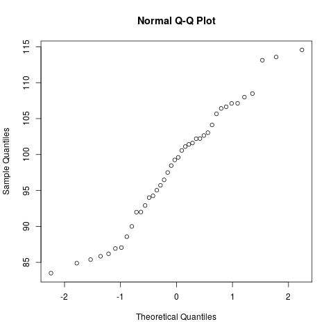

# August 08

### Statistical software

As you may have realized by now, some statistics problems are
excruciatingly tedious to do by hand. And this is just a class in
*elementary statistics*. More advanced statistical techniques
require much more intense computations, including random simulations
and numerical linear algebra.

As a result, practitioners need powerful software to do even the most
rudimentary statistical analysis. And the most robust software are
ones that give the user total control. That is, programming languages.
There are two open source programming languages that are widely used
in statistics and data science:

* [R][R]. This is a language that is designed specifically for
  statistical computing.
* [Python][Python]. This is a "general purpose language". As such, it
  requires installing third-party libraries such as [pandas][pandas]
  and [statsmodels][statsmodels] in order to perform serious statistical
  computations.

Both languages are very useful. But in this class, we will demonstrate
statistical computing in R. You may find the following resources
helpful:

* [Quick-R][Quick-R]. A website of R tutorials by the author of the
  book *R in Action*.
* [R-bloggers][R-bloggers]. A feed of blog posts by R users.
* [Book of R][Book of R]. The book I am using to learn R
* [Code School's Try R][tryr]. A free, interactive tutorial on R.

### Using R as a calculator

R can be thought of as a really, really powerful calculator. The notation
is similar to that of most scientific calculators.

For example, the to calculate the golden ratio \\(\frac{1 + \sqrt 5}{2}\\):

```r
> (1 + sqrt(5)) / 2
[1] 1.618034
```

Here, `sqrt` is a **function**. When this function is applied to
the **argument** 5, then it evaluates to 1.618034. There are many, many
functions. Documentation for any function can be displayed with the
`help` function. Issue the following command to see the help function for
`sqrt`:

```r
> help(sqrt)
```

Try calculating the following using only one R command:

\\[\frac{0.35 - 0.32}{\sqrt{0.343(1-0.343)}{\sqrt{\frac{1}{15}
+\frac{1}{20}}}}.\\]

Remember to use parenthesis to group parts of an expression!

Some tips:

* R (and most programming languages) adopt the arithmetic order of
  operations. This means for example, that `3 + 4 * 5` will evaluate
  to 23 instead of 35.
* Only paranthesis `( )` and mustaches `{ }` can be used for grouping in R.
  Using brackets `[ ]` will produce an error. This is becaused brackets
  are used for other things.
* Multiplication must use an asterisk `*`. For example, `3(2)` will
  produce an error. Use instead `3 * 2`.
* \\(\frac{5}{6 \sqrt{2}}\\) can be evaluate with `5 / (6 * sqrt(2))` or with
  `5 / 6 / sqrt(2)`. The latter is easier to read.

### Descriptive statistics

R is more than just a calculator. It is a framework for doing statistics.
As such, there must be functionality for working with data. The simplist
way that R represents data is through **vectors**.

Vectors can be constructed using the `c` function (c for combine). For
example, the following is a vector consisting of the first six prime
numbers:

```r
> c(2,3,5,7,11,13)
[1]  2  3  5  7 11 13
```
Retyping this expression is tedious. So we can instead store data in
**variables** using the operator `<-`:

```r
> prime_numbers <- c(2,3,5,7,11,13)
```

Vectors can also be generated randomly. For example, the `rnorm` function
creates a vector of independent normal random variables. Below we generate
such numbers and do descriptive statistics

```r
> # Generate 40 raandom normal numbers with mean 100 and stdev 10.
> random_variates <- rnorm(40, 100, 10)
> # sample man
> mean(random_variates)
[1] 98.37805
> # standard deviation
> sd(random_variates)
[1] 8.557046
> summary(random_variates)
   Min. 1st Qu.  Median    Mean 3rd Qu.    Max. 
  83.50   92.00   99.43   98.38  104.50  114.60 

> # stem and leaf plot
> stem(random_variates)

  The decimal point is 1 digit(s) to the right of the |

   8 | 3
   8 | 5566779
   9 | 022344
   9 | 566789
  10 | 0111222334
  10 | 6677788
  11 | 34
  11 | 5

> # normal quantile-quantile plot for testing normality
> qqnorm(random_variates)
```
The last command produced the following plot:



This plot compares "theoretical quantiles" of the standard normal
distribution with the "actual quantiles" of the data. If the scatterplot
is approximately linear, then normality may be assumed. The y-intercept
and slope for a normal Q-Q plot are estimators of the mean and standard
deviation, respectively.

### Inferential statistics

Functions also exist for performing inferential statistics.

Functions for calculating p-values:

* `pnorm` for z-statistics
* `pt` for t-statistics (requires a degrees-of-freedom argument)
* `pf` for F-statistics (requires two degrees-of-freedom arguments)
* `pchisq` for \\(\chi^2\\)-statistics (requires a degrees-of-freedom
   argument)

Note that these functions return the size of the left tail. For right
tails, one can subtract the above function from 1. For example:

```r
> # p-value of two-tailed t-test with t=2.3 and df=12.
> 2 * (1 - pt(2.3, 12))
[1] 0.04019757
```

Similary, functions for calculating critical values:

* `qnorm` for z-tests.
* `qt` for t-tests.
* `qf` for F-tests.
* `qchisq` for \\(\chi^2\\) tests.

Note that "q" stands for quantile, which gives the test statistic
corresponding to the size of the left tail. In class, we defined
our critical values as being test statistics corresponding the
the given size of the right tail. For example, to calculate
\\(z_{0.05}\\):

```r
> qnorm(1 - 0.05)
[1] 1.644854
```

There are also functions that perform an entire hypothesis test
for you (given raw data). These functions include:

* `t.test` for peforming one- and two-population t-tests (paired
   and independent).
* `prop.test` for peforming one- and two-population z-tests.
* `chisq.test` for peforming goodness-of-fit and independence tests.
* `aov` for analysis of variance (complicated)
* `lm` for linear regression (complicated)

The following example generates two random variables and performs a
two-population t-test comparing their means:

```r
> # Generate two independent, normal samples of
> sample_1 <- rnorm(10, 14, 5)
> sample_2 <- rnorm(24, 15, 7)
> # Perform a two-sample t.test
> t.test(sample_1, sample_2)

	Welch Two Sample t-test

data:  sample_1 and sample_2
t = -0.84253, df = 13.14, p-value = 0.4146
alternative hypothesis: true difference in means is not equal to 0
95 percent confidence interval:
 -8.662037  3.797599
sample estimates:
mean of x mean of y
 12.86251  15.29473 
```

Check this [tutorial][tutorial] for more examples.

[R]: https://www.r-project.org/
[Python]: https://www.python.org/
[pandas]: http://pandas.pydata.org/
[statsmodels]: www.statsmodels.org/
[Quick-R]: http://www.statmethods.net/
[R-bloggers]: https://www.r-bloggers.com/
[Book of R]: https://www.nostarch.com/bookofr
[tryr]: https://www.codeschool.com/courses/try-r
[tutorial]: http://www.statmethods.net/stats/index.html