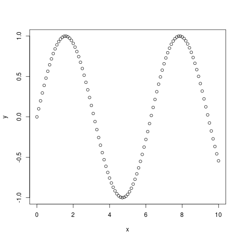

# August 09

### Working with data

R has several important data structures, including:

* **Vectors**. Used for sequences of data of the same datatype.
* **Matrices**. Used for 2D arrays of data of the same datatypes.
* **Lists**. Used for sequences of data of possibly different
  datatypes.
* **Data Frames**. Used for 2D arrays of data of possibly different
  datatypes.
* **Factors**. Useful for working with categorical data.

Today, we work with vectors and data frames.

R offers a plethora of example datasets to work with. To list these
datasets, issue the `data()` function (no arguments).

### Vectors

A vector can be thought of as a sequence of elements of the same data
type. Most of this time, we deal with numerical vectors. However,
logical vectors (whose components are `TRUE` and `FALSE`) are common,
as are vectors of strings (such as `"pineapple"`).

Particular values of a vector may be extracted by specifying the index
of the desired element.

```r
> # first six prime numbers
> primes <- c(2,3,5,7,9,11)
> # first element of primes
> primes[1]
[1] 2
> # last element of primes
> primes[length(primes)]
[1] 13
```

Note that indexing in R starts at 1. Most programming languages index
starting from 0.

Vectors themselves may be used for indexing.

```r
> # second and fourth elements of primes
> primes[c(2,4)]
[1] 3 7
> # second through fourth elements of primes
> primes[2:4]
[1] 3 5 7
> # print all primes greater than 7
> primes[primes > 7]
[1] 11 13
```

Notes:

* `2:4` is shorthand for the vector `c(2,3,4)`, the vector of all
  integers from 2 to 4, inclusive.
* `primes > 7` is itself a logical vector:
   ```r
   > primes > 7
   [1] FALSE FALSE FALSE FALSE  TRUE  TRUE
   ```
   Logical vectors can be used for indexing. Only elements corresponding
   to `TRUE` are extracted from the vector. When applying an operation
   on a vector, that operation is often "distributed" on each of
   its elements, producing a number of vector. So the comparison
   `primes > 7` is done for each element of `primes`.


Functions can be plotted using vectors!

```r
> # equally spaced numbers from 0 through 10
> x <- seq(0, 10, 0.1)
> # graph the function y = sin(x)
> y <- sin(x)
> plot(x,y)
```
The result of the last command is the following graph:



### Data frames

Data frames are two-dimensional arrays of data. They can be thought of as
simple spreadsheets. Unlike spreadsheets, however, they do not contain
any formulas -- only data.

R has many example data frames built in. For example, the `sleep` dataset
contains the effects of two soporific drugs on subject's sleep.

```r
> sleep
   extra group ID
1    0.7     1  1
2   -1.6     1  2
3   -0.2     1  3
4   -1.2     1  4
5   -0.1     1  5
6    3.4     1  6
7    3.7     1  7
8    0.8     1  8
9    0.0     1  9
10   2.0     1 10
11   1.9     2  1
12   0.8     2  2
13   1.1     2  3
14   0.1     2  4
15  -0.1     2  5
16   4.4     2  6
17   5.5     2  7
18   1.6     2  8
19   4.6     2  9
20   3.4     2 10
```

There are ten patients (given by the `ID` column). Each patient is administered
two drugs (given by the `group` column). The effects on their length of sleep is
recorded in the `extra` column.

```r
> # calculate the mean extra hours of sleep (pooled for both drugs)
> mean(sleep$extra)
[1] 1.54
> # calculate the mean extra hours of sleep for group 1
> mean(sleep$extra[sleep$group == 1])
[1] 0.75
> # calculate the mean extra hours of sleep for group 2
> mean(sleep$extra[sleep$group == 2])
[1] 0.75
> # perform a paired t-test testing if the drugs have an effect
> # on the extra hours of sleep
> extra1 <- sleep$extra[sleep$group == 1]
> extra2 <- sleep$extra[sleep$group == 2]
> t.est(extra1, extra2, paired = TRUE)
> t.test(sleep$extra[sleep$group == 1], sleep$extra[sleep$group == 2], paired=TRUE)


	Paired t-test

data:  extra1 and extra2
t = -4.0621, df = 9, p-value = 0.002833
alternative hypothesis: true difference in means is not equal to 0
95 percent confidence interval:
 -2.4598858 -0.7001142
sample estimates:
mean of the differences 
                  -1.58
```

Note that the `$` operator is used to extract a column from a data frame. The
result is typically a vector.

### Extra Credit (Due August 10)

The following vectors are built into R:

* `state.name` : a character vector consisting of all 50 US states.
* `state.region` : a character vector consisting of the regions each state is
  contained in (North, West, etc.)
* `state.area` : a numeric vector consisting of the areas of each state (in
  square miles).

The above vectors are paired in that they are all ordered alphabetically by the
states' names.

Calculate each of the following with one R command. To receive credit, specify
both the exact R command that you used and the result of that command.


1. The area of New Jersey.
2. The list of all states in the "South" region.
2. The average areas of all states in the "South" region.

**Note.** You may use online resources to learn more of R. But you may not
receive help specific to this problem from anyone. The solutions you submit
must be entirely of your own doing.