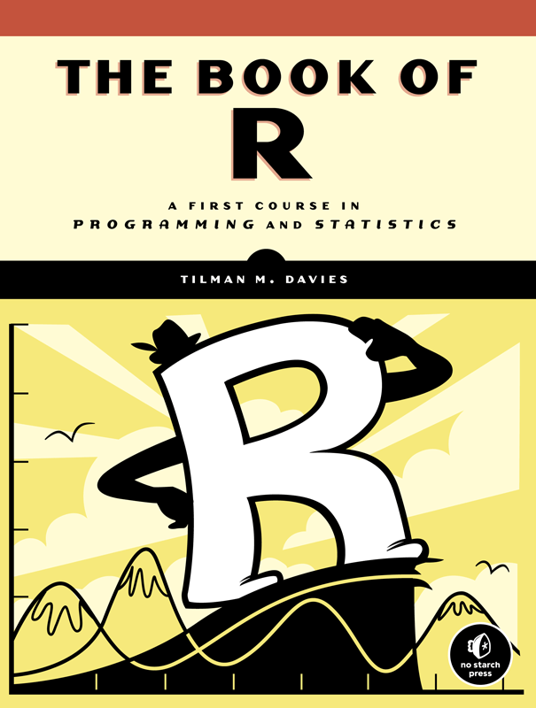
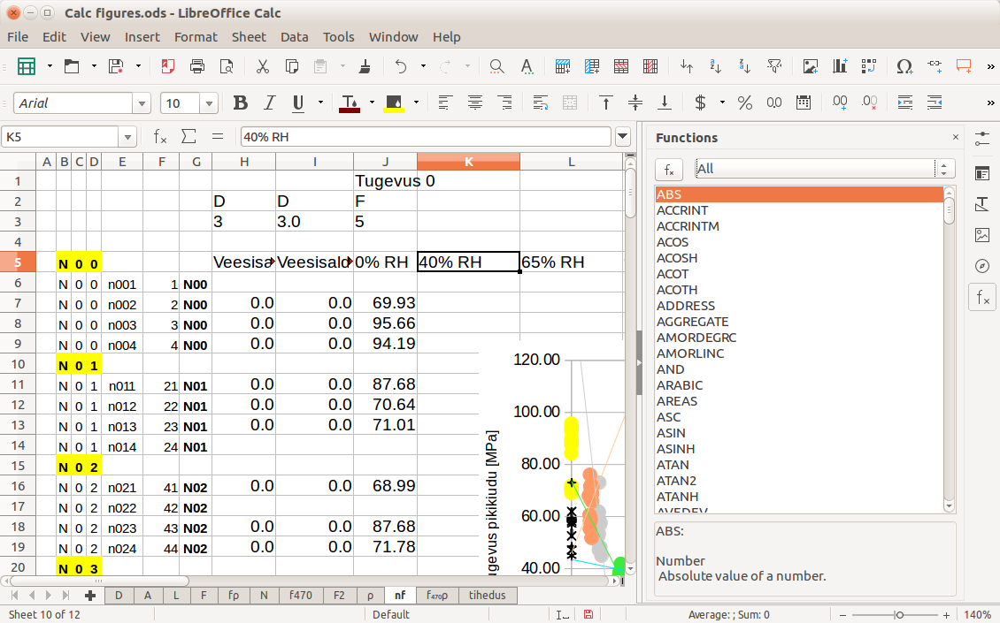

# August 10

We spent two days demoing statistical computing in R. While there
is still much that *can* be covered on the topic, I feel that it
is best to let the topic go. The goal of this week is to introduce
statistical computing, not be a crash course of R programming.

### R

The two days we spent discussing R has been well spent. You learned
a lot about of R's statistical and data manipulation features. There
is, however, a *lot* more to learn.

I recommend reading *The Book of R* by Tilman Davies. This book is
actually available at the college library.

### Python

Python is similar language to R. When planning this course, I struggled
to determine whether we should demo Python or R. I picked R for three
reasons:

1. It gives me a chance to refresh my knowledge of R.
2. R is designed specifically for statistics and data analysis.
3. R is easier to install on Windows.

The first point is somewhat selfish. I am already fluent in Python, so
it does not provide me much personal benefit in reviewing it.

The second point is not that convincing. Most people consider Python
as being useful for things like web development and scripting. However,
it has a lot of popularity in scientific/statistical computing. This
requires installing third-party libraries like [pandas][pandas] and
[NumPy][numpy]. [Jupyter](http://jupyter.org/) is a popular interface
for interacting with both Python and R (and other languages like
Julia, Octave, Ruby, etc.).

The third point can be alleviated by using the third-pary package
manager [Anaconda][anaconda] by *Continuum Analytics*. 

For a resume standpoint, I am not sure if there is much benefit to
learning R *and* Python over just R *or* Python. So it may be wise to
learn just one of them. Both are attractive in different ways.
Python has more name recognition, but R seems to be more of a
"professional" tool.

### SQL

SQL stands for *structured query language*. It is a universal (not really)
language for interacting with *relational database management systems*
(RDMS) such as MySQL, MariaDB, PostgreSQL, SQLite, etc.

### Spreadsheet applications

For most people, the phrase "spreadsheet application" is synonymous with
*Microsoft Excel*. However, [LibreOffice Calc][LoCalc] is a mostly
compatible alternative. And unlike Excel, Calc is free and open source.

At its core, an electronic spreadsheet is a grid of cells containing
numbers and formulas. When any of the cells are altered, the formulas
are recalculated.

Of the four technologies discussed, spreadsheet applications seem the
most predestrian. However, they are ubiquitous and intuitive. And many
job postings list spreadsheet application (specifically Excel) proficency
as required.

Many people claim "profienciency" with spreadsheet applications. However,
few can claim to be power users. Being able to create pivot tables,
use VLOOKUP, use keyboard shortcuts, and create macros (VBA on Excel,
LO Basic on Calc) are skills that can make you stand out from the rest.

### Extra Credit (Due August 14)

Complete the following [OpenIntro Statistics labs][labs]:

* Intro to R and RStudio
* Introduction to Data
* Inf. for Numerical Data

Each lab is graded seperately (4 points each). For each lab, complete the
*On your own* sections and write a lab report on it. Include the R commands
you used to solve each problem. You will be partially graded on clarity.

[LoCalc]: https://www.libreoffice.org/discover/calc/
[pandas]: http://pandas.pydata.org/
[numpy]: http://www.numpy.org/
[anaconda]: https://www.continuum.io/downloads
[labs]: https://www.openintro.org/stat/labs.php