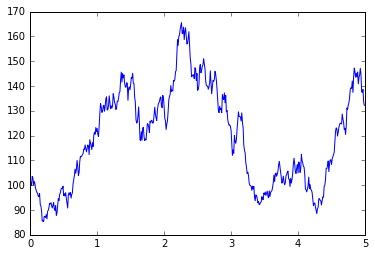

The above animation depicts simulations of the most important
stochastic process in finance: the [Wiener process][] (pronounced
"wee-ner"), also called "Brownian motion" or "white noise".

A Wiener process has the following properties:

1. It is a stochastic process. This means that is a random function
   $W(t)$ of time $t \geq 0$.
2. $W(0) = 0$.
3. $W(t+h)-W(t)$ is a random variable with a normal distribution of
   mean 0 and variance $|h|$.
4. $W(t+h)-W(t)$ is independent of $W(s)$ if $s \leq t$ and $h > 0$.

These properties are enough to obtain time series realizations of the
Wiener process using the following algorithm:

1. Choose a value of $\Delta > 0$ that is sufficiently small.
2. Set $t_n = n \cdot \Delta$ for $n = 0, 1, \ldots$. These are the
   discrete values of time for which $W$ will be realized.
3. Set $W_0 = 0$ and
   $$W_{n+1} = W_n + \sqrt{\Delta} Z_n$$
   for $n=0,1, \ldots$. Here, the $Z_n$'s are independent standard
   normal variables.

This algorithm may be implemented in any programming language with a
random number generator. Check out the [source code][] to the above
animation for a simple Javascript implementation (using the `p5.js`
library).

Diffusion processes
-------------------

Upon initial inspection, the animation seems to depict the price of a
stock plotted over time. It is tempting, therefore, to model stock
prices as (scaled and shifted) Wiener processes.

While tempting, such an attempt is problematic. Wiener processes are
normally distributed. This would result in a possibility of negative
stock prices.

This does not render the Wiener process worthless. Many continuous
stochastic processes can be defined in terms of Wiener processes. Such
processes are known as [Ito diffusion processes][].

An Ito diffusion process $X(t)$ is a stochastic process that satisfies
the following equation:
$$dX = \alpha dt + \beta dW.$$

Here, $d$ stands for *differential of*. So $dX$ is a differential of
$X(t)$, $dt$ is a differential of time $t$, and $dW$ is a differential
of a Wiener process $W(t)$.

The functions $\alpha$ and $\beta$ are themselves stochastic processes.
If the value of $W(s)$ is known for $0 \leq s \leq t$, then it is
assumed that $\alpha (t)$ and $\beta(t)$ become non-random constants.
Using mathematical jargon: the stochastic processes $\mu$
and $\sigma$ are adapted to the [filtration][] generated by $W$.

We often consider $\alpha$ and $\beta$ as being functions
of $X(t)$ and $t$. When this is the case, the the equation $dX =
\alpha dt + \beta dW$ is called a [stochastic differential equation][].
And the stochastic process $X(t)$ is [Markovian][] (memoryless).

Euler simulations
-----------------

Ito diffusion processes $X(t)$ may be simulated in a similar manner
as to how the Wiener process $W(t)$ was simulated. Assume that
$dX = \alpha dt + \beta dW$. Then

1. Choose a sufficiently small value of $\Delta > 0$.
2. Set $t_{n} = n \cdot \Delta$ for $n = 0,1, \ldots$.
3. Simulate the values of $W_n$ as previously described.
4. Calculate the values of $\alpha (t_n) = \alpha_n$ and $\beta (t_n)
   = \beta_n$. This is usually possible because $\alpha$ and $\beta$
   are adopted to $W(t)$'s generated filtration. This usually means that
   $\alpha_n$ and $\beta_n$ are functions of the sequence $W_1, \ldots,
   W_n$.
5. Calculate $X_{n+1}$ as $X_n + \alpha_n \Delta + \beta_n \sqrt{\Delta}
   Z_n$, where the $Z_n$'s are independent standard normal variables.

These steps are summarized by the equation
$$X_{n+1} - X_n = \alpha_n \Delta  + \beta_n \sqrt{\Delta} Z_n.$$

This is a discretization of the SDE $dX = \alpha dt + \beta dW$.

Differentials  Finite differences
-------------  ------------------------
$dt$           $\Delta = t_{n+1} - t_n$
$dW$           $\sqrt{\Delta} Z_n$
$dX$           $X_{n+1} - X_n$

Running such simulations requires first knowing the value of
$X_0 = X(0)$.

Geometric Brownian motion
-------------------------

The following SDE defines a [geometric Brownian motion][] $X(t)$:
$$dX = \mu X dt + \sigma X dW.$$

Here, $\mu$ (the drift parameter) and $\sigma$ (the volatility
parameter) are constants. Roughly speaking, $\mu$ measures the
statistical tendency for $X(t)$ to increase (if $\mu>0$) or to decrease
(if $\mu < 0$). And $\sigma$ measures the degree to which $X(t)$ is
effected by randomness.

It can be shown that $X(t)$ is [lognormally distributed][]. This follows
from its exact solution (to be proven later):
$$X(t) = X(0) \exp \left( \left(\mu - \frac{1}{2} \sigma^{2} \right)t +
\sigma W(t) \right).$$

A consequence of this is that the values of $X(t)$ are positive.
Therefore, it is somewhat reasonable to model stock prices as geometric
Brownian motions. Moreover, arbitrage pricing theory asserts that
$$\mu = \text{interest rate} - \text{dividend yield}.$$
Consequently, $\sigma$ the only parameter that needs to be statistically
estimated.

Pictured below is a simulation of a GBM with 20% volatility:

[Wiener process]: https://en.wikipedia.org/wiki/Wiener_process
[source code]: ../static/sketch.js
[Ito diffusion processes]: https://en.wikipedia.org/wiki/Diffusion_process
[geometric Brownian motion]: https://en.wikipedia.org/wiki/Geometric_Brownian_motion
[stochastic differential equation]: https://en.wikipedia.org/wiki/Stochastic_differential_equation
[filtration]: https://en.wikipedia.org/wiki/Filtration_(mathematics)
[Markovian]: https://en.wikipedia.org/wiki/Markov_property
[lognormally distributed]: https://en.wikipedia.org/wiki/Log-normal_distribution

