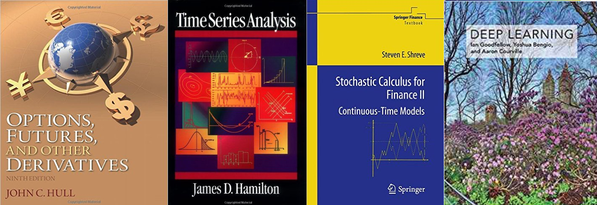

Quantitative finance learners and practitioners are blessed with a large
and ever-changing library of technical literature. It can feel
overwhelming. However, most of the essential practical and theoretical
knowledge is contained in just four books:

* ***Options, Futures, and Other Derivatives*** by John Hull. This is
  the go-to tome of finance for finance-virgin mathematicians (like
  myself). While not particularly deep or technical, its coverage is
  broad and up-to-date. A new edition is published every few years.
* ***Stochastic Calculus for Finance II: Continuous-Time Models*** by
  Steven Shreve. This is the textbook loved and hated by every [Rutgers
  MSMF][] student. Stochastic/Ito calculus is an essential field, where
  many theoretical results (Feynman-Kac Theorem, Girsanov Theorem,
  Martingale Representation Theorem, *etcetera*) have immediate
  consequences in financial modeling. There is a volume I that covers
  the binomial tree model. I would not recommend it.
* ***Time Series Analysis*** by James Hamilton. If stochastic calculus
  is theory, then time series analysis is practice. Quantitative finance
  is just applied time series analysis. And Hamilton's treatment is both
  sophisticated and approachable.
* ***An Introduction to Statistical Learning: with Applications in R***
  by Gareth James and Daniela Witten. The future belongs to robots.

[Rutgers MSMF]: http://finmath.rutgers.edu/
