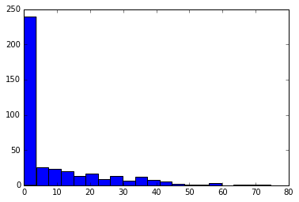

In the [first post][], we established that diffusion processes may be
simulated computers. Creating many such simulations allows one to
easily perform financial calculation. For example, one can valuate a
portfolio by running a series of simulations and averaging the results.
Such techniques are called [Monte Carlo methods][].

Lets consider a European-style [call option][]. This financial
derivative guarantees the right (but not obligation) of the holder to
purchase one unit of a specific financial security (the underlying) at
a specific time (expiration) and at a given price (strike).

The value of such an option is easy to valuate at expectation. Let
$X(T)$ be the price of the underlying at expiration $T$. And let $K$ be
the strike. If $X(T) > K$, then one can purchase the underlying at a
discount worth $X(T) - K$. If $X(T) < K$, then the option is worthless
because exercising it would put the holder at a net loss. The value of
the call option at expiry is thus
$$(X(T) - K)^{+} = \max \left\{ X(T) - K, 0 \right\}.$$

Prior to expiry, this payoff is unknown since $X(T)$ is unknown.
However, if we treat $X(T)$ as a random variable, then we can at least
calculate the expected payoff:
$$\text{Expected payoff} = \mathbf{E} \left[ (X(T) - K)^{+} \right]$$
[Discounting][] the expected payoff with the risk-free interest short
rate will give the present value of the call option.

Consider a stock whose present value is $100. Its drift and volatility
are calibrated to be 0% and 20%/year, respectively. An at-the-money
call option (strike = $100 = present value) whose expiry is in 1 year
has an expected payoff of roughly $8. We assume that the stock prices
are GBM's.

This can be calculated with the following Python 3 code:

~~~~~~~~~~~~~~~~~~~~~~~~~~~~~~~~~~~~~~~~~~~~~~~~~~~~~~~~~~~~~~~~~~~~~~~~
from random import gauss
from math   import sqrt
payoffs = []                            #list of call option payoffs
for i in range(400):                    #400 independent simulations
    X = 100
    dt = 1.0 / 365
    for day in range(365):
        dW = gauss(0, sqrt(dt))
        dX = 0.20 * X * dW
        X = X + dX
    payoffs.append(max(X - 100, 0))
expected_payoff = sum(payoffs) / 400
print(expected_payoff)
~~~~~~~~~~~~~~~~~~~~~~~~~~~~~~~~~~~~~~~~~~~~~~~~~~~~~~~~~~~~~~~~~~~~~~~~

Not only does this give the expected payoff, but it also gives the full
probability distribution of the payoff. This is useful in, for example,
calculating confidence intervals of returns.

The above histogram shows the simulated payoffs of the aforementioned
call option. Around half of these payoffs are $0.

Accuracy
--------

... or there lack of.

Monte Carlo methods tend to be robust but slow. The true non-discounted
value of the aforementioned call option is $7.97, as calculated by the
[Black-Scholes formula][].

In comparison, here is the expected payoff calculated with Monte Carlo:

Number of Simulations  Expected Payoff  Error
---------------------  ---------------  -----
50                     $6.49            19%  
100                    $5.67            29%
200                    $7.97            0.0%
400                    $7.31            8.2%
800                    $7.84            1.6%
1600                   $8.08            1.4%
3200                   $7.87            1.3%            
6400                   $8.05            1.0%
---------------------------------------------

A large increase in the number of simulations results in only a
minuscule reduction in error.

The variance of a sample average is the variance of any one simulation
divided by the sample size $N$. Thus the variance is proportional to
$N^{-1}$. The error (the size of the confidence interval at a given
confidence) is proportional to the standard deviation. Thus error is
proportional to $N^{-1/2}$. Another way to put this is that to obtain
an error of $\frac{1}{n}$, one must make $N = O(n^{2})$ calculations.

But the above analysis assumes that obtaining the sample can be
calculated without error. This is not the case. Since we are simulating
a continuous process with a discrete one, we introduce an error of size
$O(dt)$, where $dt$ is the size of each time step. Thus the overall
error is $O(\max \{ dt, N^{-1/2} \})$.

[first post]: diffusion_processes.html
[Monte Carlo methods]: https://en.wikipedia.org/wiki/Monte_Carlo_method
[call option]: https://en.wikipedia.org/wiki/Call_option
[Discounting]: https://en.wikipedia.org/wiki/Discounting
[Black-Scholes formula]: https://en.wikipedia.org/wiki/Black–Scholes_model
